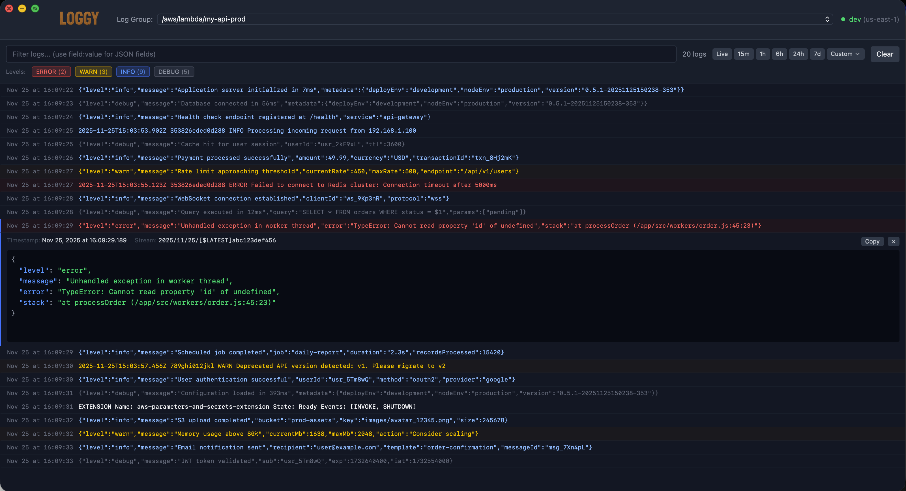

# Loggy

[](https://github.com/aegixx/aws-loggy/actions/workflows/ci.yml)
[](https://github.com/aegixx/aws-loggy/actions/workflows/release-please.yml)

A fast, native desktop app for browsing and tailing AWS CloudWatch logs.



## Features

- **Live Log Tailing** - Stream new log events in real-time with auto-scroll
- **Instant Filtering** - Client-side filtering as you type (no AWS roundtrip)
- **JSON Query Syntax** - Filter by JSON fields with `field:value` or `field.nested:value`
- **Log Level Detection** - Automatic colorization based on log level (ERROR, WARN, INFO, DEBUG, TRACE, SYSTEM)
- **Customizable Colors** - Configure log level colors and detection patterns via Settings (Cmd-,)
- **JSON Syntax Highlighting** - Collapsible, colorized JSON viewer for structured logs
- **Find in Logs** - Search within the selected log entry with regex, case-sensitive, and whole-word options
- **Context Menu** - Right-click for quick access to Copy, Find, Filter, Refresh, and Clear actions
- **Virtualized Rendering** - Smooth scrolling through 50,000+ log entries
- **Native Performance** - Built with Tauri for small bundle size and low memory usage
- **Persistent State** - Remembers your last selected log group across sessions

## Prerequisites

- [Node.js](https://nodejs.org/) 18+
- [Rust](https://rustup.rs/) (latest stable)
- AWS credentials configured via:
  - AWS CLI profiles (`~/.aws/credentials`)
  - AWS SSO
  - Environment variables (`AWS_ACCESS_KEY_ID`, `AWS_SECRET_ACCESS_KEY`)
  - IAM roles (when running on EC2/ECS)

## Installation

### From Source

```bash
# Clone the repository
git clone https://github.com/aegixx/aws-loggy.git
cd aws-loggy

# Install dependencies
npm install

# Run in development mode
npm start

# Build for production
npm run app:build
```

The built application will be in `src-tauri/target/release/bundle/`.

### Pre-built Binaries

Download the latest release for your platform from the [Releases](https://github.com/aegixx/aws-loggy/releases) page:

- **macOS**: `.dmg` installer (Apple Silicon and Intel)
- **Windows**: `.msi` or `.exe` installer
- **Linux**: `.deb`, `.AppImage`, or `.rpm`

## Usage

1. **Select AWS Profile** - Loggy uses your default AWS credentials.

2. **Choose Log Group** - Use the dropdown to select a CloudWatch log group from your account.

3. **Browse Logs** - View historical logs with automatic time range selection.

4. **Live Tail** - Click the tail button to stream new logs in real-time.

5. **Filter Logs** - Type in the filter bar to instantly filter displayed logs:
   - Simple text: `error` matches any log containing "error"
   - JSON field: `level:error` matches logs where the `level` JSON field equals "error"
   - Nested field: `user.id:123` matches nested JSON fields

6. **Toggle Log Levels** - Click level badges (ERROR, WARN, INFO, DEBUG, TRACE, SYSTEM) to show/hide specific levels.

7. **View Details** - Click any log row to expand and see the full message with JSON highlighting.

## Keyboard Shortcuts

| Shortcut           | Action                                       |
| ------------------ | -------------------------------------------- |
| `⌘F` / `Ctrl+F`    | Find text in logs                            |
| `⌘L` / `Ctrl+L`    | Focus filter input and select all            |
| `⌘R` / `Ctrl+R`    | Refresh - reconnect to AWS and re-query logs |
| `⌘K` / `Ctrl+K`    | Clear logs (keep filters, re-fetch)          |
| `⌘,` / `Ctrl+,`    | Open Settings                                |
| `⌘A` / `Ctrl+A`    | Select all visible logs                      |
| `⌘C` / `Ctrl+C`    | Copy selected messages to clipboard          |
| `Tab`              | Focus log viewer for keyboard navigation     |
| `↑` / `↓`          | Navigate between log rows                    |
| `Page Up` / `Down` | Jump one page at a time                      |
| `Home` / `End`     | Jump to first / last log                     |
| `Space` / `Enter`  | Expand / collapse selected log               |
| `Escape`           | Close dialogs / collapse expanded log        |

## Development

```bash
# Run with hot reload
npm start

# Format code
npm run fmt

# Lint code
npm run lint

# Build production app
npm run app:build
```

### Tech Stack

- **Backend**: [Tauri 2.x](https://tauri.app/), Rust, [AWS SDK for Rust](https://aws.amazon.com/sdk-for-rust/)
- **Frontend**: React 19, TypeScript, [Zustand](https://zustand-demo.pmnd.rs/), [react-window](https://github.com/bvaughn/react-window), Tailwind CSS v4

### Project Structure

```text
loggy/
├── src-tauri/          # Rust backend
│   └── src/lib.rs      # Tauri commands & AWS integration
├── src/                # React frontend
│   ├── components/     # UI components
│   ├── stores/         # Zustand state management
│   └── types/          # TypeScript definitions
├── docs/
│   └── DESIGN.md       # Architecture documentation
└── CLAUDE.md           # AI assistant instructions
```

## Contributing

Contributions are welcome! Please feel free to submit a Pull Request.

1. Fork the repository
2. Create your feature branch (`git checkout -b feature/amazing-feature`)
3. Run formatting and linting (`npm run fmt && npm run lint`)
4. Commit your changes using [Conventional Commits](https://www.conventionalcommits.org/):
   - `fix: description` for bug fixes (patch release)
   - `feat: description` for new features (minor release)
   - `feat!: description` or `BREAKING CHANGE:` for breaking changes (major release)
5. Push to the branch (`git push origin feature/amazing-feature`)
6. Open a Pull Request

Releases are automated via [release-please](https://github.com/googleapis/release-please) based on conventional commit messages.

## License

This project is licensed under the MIT License - see the [LICENSE](LICENSE) file for details.

## Acknowledgments

- [Tauri](https://tauri.app/) for the excellent desktop framework
- The AWS SDK team for the Rust SDK

## Future (potential) features

- (!) Control over default font size, family, & line height
- On unfilter, scroll to maintain selected row position
- Debug / application logging for better troubleshooting
- Cloudwatch Filter Syntax support
- Regex filter support (`/pattern/`)
- Configurable datetime format
- Saved/favorite queries
- (!) Export to JSON/CSV
- CloudWatch Logs Insights integration
- (!) Multiple tabs / panes support - for viewing multiple streams simultaneously
- Alternate file support (e.g. local files, Azure Log Analytics, etc.)
- Multi-source aggregation (e.g. combine logs from multiple sources into a single view)
- Multi-region support
- Multi-account support
- Timeline / histogram view based on volume
- Stacked timeline view based on log level
- Configurable Group By filters (i.e. by JSON path)
- Load more button for loading logs outside of filtered time range
- (?) Pagination support
